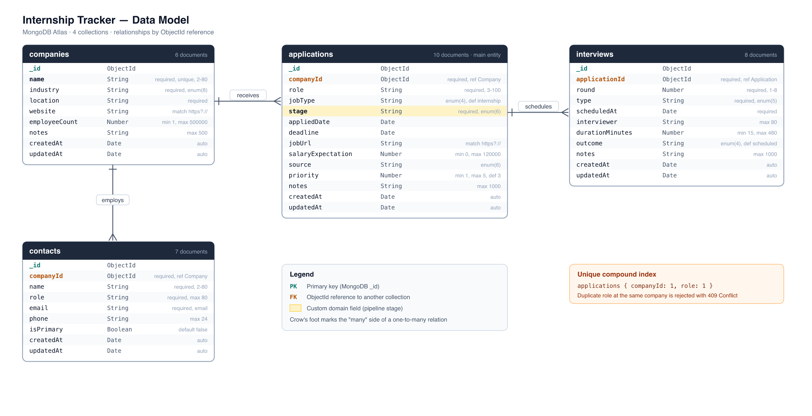

# Internship Tracker — Lab Report

**Course:** DA219B Fullstack Lab, Kristianstad University  
**Stack:** React (Vite) · Express.js · MongoDB Atlas · Mongoose

## 1. System overview

Internship Tracker helps a student follow internship applications from wishlist to offer. Each application belongs to a company and can have several interview rounds. The React app shows a Kanban board and a sortable table, with search and stage filters. The Express API provides full CRUD, two relational endpoints, and pipeline statistics. Data lives in MongoDB Atlas in four collections linked by `ObjectId` references.

## 2. Database design



| Collection | Role | Links to |
| --- | --- | --- |
| `companies` | Employers | — |
| `applications` | One role at one company (main entity) | `companyId → companies` |
| `interviews` | Interview rounds | `applicationId → applications` |
| `contacts` | Recruiters / contacts | `companyId → companies` |

**Custom field:** `stage` on applications (`wishlist`, `applied`, `screening`, `interview`, `offer`, `rejected`). The UI and stats are built around this field. Companies and interviews stay in separate collections so data can grow without copying the same company into every application. A unique index on `companyId + role` stops duplicates.

## 3. Two API endpoints

**`POST /api/applications`** — creates an application after checking the company exists and the role is not already tracked.

Request body (example):

```json
{ "companyId": "66b1…", "role": "Backend Intern", "jobType": "internship", "stage": "applied", "priority": 5 }
```

Success: `201` with the saved document (`companyId` populated). Errors: `400` validation, `404` missing company, `409` duplicate role at that company.

**`GET /api/stats/pipeline`** — custom stats endpoint. Groups applications by `stage` and returns dashboard numbers (totals, offers, response rate, count per stage).

```json
{ "total": 10, "active": 8, "offers": 2, "responseRate": 70, "stages": [{ "stage": "interview", "count": 2 }] }
```

## 4. Reflection

**Challenge:** Seeding related collections. Interviews need application ids, and applications need company ids, but MongoDB only creates those ids after insert.

**Solution:** Seed data uses readable keys (`company: 'axis'`). The script inserts companies first, maps keys to ids, then applications, then interviews with key `company::role`.

**Learned:** Insert order must follow relationships. Keep human keys in the seed file and swap them for real `ObjectId`s at runtime. That uniqueness idea became the compound index on applications.

## 5. Feature iteration: stage filtering

**First** — commit `0d3d50f` (*feat: add stage and search filtering to the applications view*): the API returned every application; the browser filtered with `useMemo`. Easy, but the 15-second refresh still downloaded the full list.

**Second** — commit `7f08586` (*refactor: move stage filtering to a backend query param*): the API accepts `?stage=` and `?search=` and filters in MongoDB. Only matching rows are returned. Dock badges still use `/api/stats/pipeline` so counts stay global. This keeps payloads small as data grows and is easy to test in Postman.
